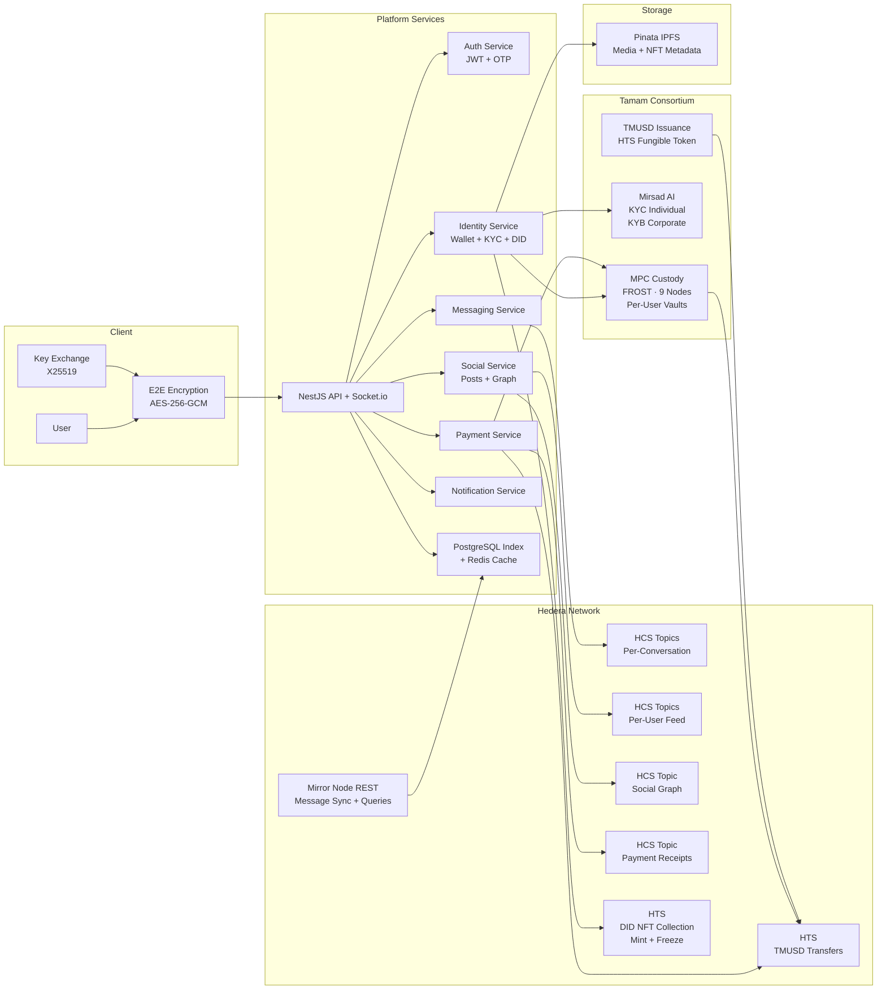

# Kalam Network — Pitch Deck

**Hedera Hello Future: Apex Hackathon 2026 | Open Track**

---

## Slide 1: Title

**Kalam Network**

Own your identity. Encrypt your conversations. Move your money.

*Open Track — Hedera Hello Future: Apex Hackathon 2026*

Muneef Halawa · Dmitrij Titarenko

---

## Slide 2: The Problem

**People don't own their digital lives.**

Your social identity, your message history, your financial relationships — all controlled by platforms that can revoke access overnight. No portability. No proof. No recourse.

**Businesses can't communicate with trust.**

A bank messages a client — no cryptographic proof it happened. A corporation sends a payment — three intermediaries take a cut. A compliance team audits communication — the logs are editable. Cross-border B2B still runs on email, PDFs, and hope.

**The world needs infrastructure where identity is owned, communication is provable, and payments are instant.**

---

## Slide 3: The Solution

**Kalam Network — where your wallet is your identity.**

| What you get | How it works |
|---|---|
| **Permanent digital identity** | Hedera account + soulbound DID NFT — verifiable, portable, yours forever |
| **Provable communication** | Every message E2E encrypted and consensus-timestamped on Hedera |
| **Instant stablecoin payments** | TMUSD transfers through MPC custody — no intermediaries |
| **Compliance by design** | KYC/AML screening at onboarding, immutable audit trail on every transaction |
| **Enterprise-ready from day one** | Organizations, role-based access, broadcast channels, verified identities |

One platform. Identity + communication + payments + compliance. Fully built.

---

## Slide 4: Why Hedera

| | Hedera | Ethereum | Solana |
|---|---|---|---|
| **Finality** | 3–5 seconds | ~12 minutes | ~13 seconds |
| **Throughput** | 10,000+ TPS | ~15 TPS | ~4,000 TPS |
| **Fees** | Fixed in USD | Gas auction (volatile) | Low but variable |
| **Native tokens** | HTS (no contract needed) | ERC-20/721 (contract deploy) | SPL (contract deploy) |
| **Governance** | 39-member enterprise council | Decentralized validators | Decentralized validators |

**Why this matters for Kalam:** Fixed USD fees = predictable unit economics at any scale. Native HTS = DID NFTs and stablecoin transfers without deploying smart contracts. HCS = sub-cent consensus timestamps on every message. Enterprise council = institutional trust for banks and corporates.

---

## Slide 5: What Kalam Unlocks

**For individuals:**
- Your identity survives any platform — it's on a public ledger, tied to your wallet
- Your messages are yours — encrypted end-to-end, the platform literally cannot read them
- Your payments are instant — stablecoin, no bank delays, no conversion fees

**For businesses:**
- Every client communication has cryptographic proof — tamper-evident, auditable
- Payments settle in seconds with an immutable receipt — not days with reconciliation
- Compliance is automatic — KYC/KYB at onboarding, every transaction on-chain
- Role-based access and broadcast channels — secure internal and external communication

**For the Hedera ecosystem:**
- Every user = a new Hedera account
- Every message, post, payment, follow = a real Hedera transaction
- 279M annual transactions at 100K users — organic, sustained network activity

---

## Slide 6: Architecture

**Write path:** User action → E2E encrypt → Platform service → Hedera transaction → Mirror Node → PostgreSQL index

**Read path:** User query → PostgreSQL (fast) → return. Cache miss → Mirror Node → update index → return.

**Source of truth:** Hedera. PostgreSQL is an index. If the database is wiped, the entire platform state can be reconstructed from on-chain data.

**6 Hedera SDK transaction types** in production: `TopicCreate`, `TopicMessageSubmit`, `TokenMint`, `TokenFreeze`, `Transfer`, `AccountCreate`

---

## Slide 7: Every Action Generates Value

| What the user does | What happens on Hedera | Why it matters |
|---|---|---|
| Creates an account | Hedera account + MPC vault created | New wallet on the network |
| Verifies identity | DID NFT minted and frozen (soulbound) | Permanent, verifiable credential |
| Sends a message | Encrypted payload → HCS topic | Provable, timestamped communication |
| Makes a post | Content → personal feed HCS topic | Censorship-resistant publishing |
| Follows someone | Social graph event → HCS | Portable, owned social connections |
| Sends payment | TMUSD transfer + HCS receipt | Instant settlement with audit trail |
| Requests payment | Request stored on HCS | Transparent, trackable obligations |
| Splits a bill | N transfers + HCS events | Multi-party settlement in seconds |

**Nothing is simulated. Every row above is a real Hedera transaction in our codebase.**

---

## Slide 8: Security & Compliance

**Encryption — Signal-equivalent architecture:**
- AES-256-GCM per message, fresh nonce every time
- X25519 key exchange per conversation
- Platform never possesses plaintext — only encrypted blobs transit the server

**Custody — Tamam MPC:**
- FROST threshold signing across 9 nodes
- Per-user vault isolation — no shared keys
- No single point of compromise

**Compliance — Mirsad AI:**
- KYC (individual) + KYB (corporate) at onboarding
- Sanctions screening, document verification
- Compliant by design — not by surveilling communication

---

## Slide 9: TMUSD — Our Stablecoin Infrastructure

**We don't use someone else's stablecoin. We issue our own.**

TMUSD is issued by the Tamam Consortium on Hedera Token Service.

| Advantage | Impact |
|---|---|
| **Control the payment rail** | No dependency on third-party issuers |
| **Compliance at the token level** | KYC-gated transfers built in |
| **Revenue from every transfer** | 0.1–0.5% micro-fee on transactions |
| **Enterprise trust** | Consortium-backed, regulated, not algorithmic |

Every payment on Kalam is a real TMUSD transfer, MPC-signed, with an immutable HCS receipt.

---

## Slide 10: Competitive Positioning

| | Kalam | Telegram | Signal | Banking Apps |
|---|---|---|---|---|
| **Owned identity** | Soulbound DID NFT | Platform-controlled | Phone number | Bank-controlled |
| **E2E encryption** | AES-256-GCM + X25519 | Optional | Default | Varies |
| **On-chain proof** | Every message timestamped | None | None | Internal logs |
| **Native payments** | TMUSD stablecoin | TON (separate) | None | Bank transfers |
| **KYC/AML built-in** | At onboarding | None | None | Siloed |
| **Org & RBAC** | Built-in | Basic groups | None | Varies |
| **Audit trail** | Immutable, public ledger | None | None | Editable |

---

## Slide 11: Market Opportunity

**Primary markets: MENA + United States. Goal: global.**

| Market | Size | Our angle |
|---|---|---|
| **MENA digital payments** | $251B (2025) → $423B by 2030 | Built here, not shipped here. Native compliance. |
| **US/Global secure communications** | $34.5B (2024) → $65B by 2033 | Decentralization + provable audit trail for enterprises |
| **MENA social media users** | 250M+ active, 565M smartphones | Zero homegrown platforms — all imported |
| **Global enterprise messaging security** | $10.4B (2026) → $39.9B by 2034 | E2E encrypted + on-chain proof = new category |

**Beachhead:** MENA for retail adoption (diaspora, crypto-native). US for enterprise (banks, corporates, compliance-heavy industries). Expand globally from both.

---

## Slide 12: Transaction Economics

**Every user action generates Hedera network activity.**

| Action | Cost |
|---|---|
| Onboard 1 user (account + DID NFT + topics) | $0.122 |
| Send 1 message | $0.0008 |
| Send 1 payment (TMUSD + receipt) | $0.0018 |
| Create 1 post | $0.0008 |

**At scale:**

| Users | Daily TXs | Annual TXs | Annual Cost | Cost/User/Mo |
|---|---|---|---|---|
| 1K | 7,650 | 2.8M | $2,270 | $0.19 |
| 10K | 76,500 | 27.9M | $22,703 | $0.19 |
| 100K | 765,000 | 279M | $227,030 | $0.19 |

**$0.19/user/month** in network fees. At $5/user/month revenue, that's **3.8% cost-of-revenue** — viable at any scale.

---

## Slide 13: Business Model

| | |
|---|---|
| **Segments** | Individuals (global, crypto-native, privacy-conscious) · Businesses (banks, corporates, government, compliance-heavy) |
| **Revenue** | Freemium base · Organization subscriptions · 0.1–0.5% on TMUSD transfers · Enterprise deployment + SLA |
| **Cost** | $0.19/user/month Hedera fees · Infrastructure · KYC screening costs |
| **Advantage** | Own stablecoin rail · Own custody infrastructure · Own KYC infrastructure · MENA + US dual-market presence |

---

## Slide 14: Ecosystem Partners

| Partner | Role | Status |
|---|---|---|
| **Tamam MPC Custody** | Wallet creation, FROST threshold signing, per-user vaults | Integrated in code |
| **Mirsad AI** | KYC/AML — individual + corporate screening | Integrated in code |
| **TMUSD (Tamam Consortium)** | Stablecoin issued on HTS — our payment rail | Integrated in code |
| **Pinata IPFS** | Decentralized storage for media + NFT metadata | Integrated in code |

All production APIs. Real authentication, real error handling, real response parsing. Not planned — built.

---

## Slide 15: Roadmap

| Phase | What | When |
|---|---|---|
| **Launch & first clients** | Web app live · First enterprise org accounts onboarded · MENA early adopters · TMUSD mainnet | Q2 2026 |
| **Mobile + marketplace** | React Native app · Product marketplace for organizations · Smart contract escrow · API for third-party integrations | Q2–Q3 2026 |
| **Enterprise expansion** | US enterprise sales · Compliance certifications · Multi-org management · Advanced org analytics & reporting | Q3 2026 |
| **Platform ecosystem** | Token-gated communities · On-chain governance · Developer SDK · Org-to-org secure channels · Marketplace for verified services | Q3–Q4 2026 |
| **Global scale** | Additional markets · Local compliance frameworks · Partner network · White-label enterprise deployment | 2027 |

---

## Slide 16: Team

**Muneef Halawa** — CEO & Founder
14+ yrs MENA financial intelligence & compliance · Financial crime analysis, cross-border enforcement · MIT-certified AI/ML · Native Arab building from within the region

**Dmitrij Titarenko** — CPO & Co-Founder
7+ yrs banking, insurance & enterprise fintech · AML/fraud systems, B2B platforms · Drove mobile banking to top market positions · Math-driven product decisions

---

## Slide 17: Thank You

**Kalam Network**

The last time a region built its own social infrastructure, it changed how billions of people communicate.

We're building the next one — on Hedera.

GitHub · Live Demo · [Demo Video]

---

## Appendix: Methodology & Sources

*Not a slide — reference for judges reviewing claims.*

**Hedera fees (March 2026):** HCS submit $0.0008 ([Jan 2026 update](https://hedera.com/blog/price-update-to-consensussubmitmessage-in-consensus-service-january-2026/)) · Topic create $0.01 · Account create $0.05 · NFT mint $0.05 · Token freeze $0.001 · HTS transfer $0.001

**Transaction formula:** Daily per-user: 5 messages + 1 post + 0.2 follows + 0.5 payments + 0.2 conversation ops + 0.25 request fulfillments = 7.65 TXs/day. Annual cost = (users × 7.15 × 365 × $0.0008) + (users × 0.5 × 365 × $0.001).

**Market sources:**
- MENA digital payments $251B: [Mordor Intelligence](https://www.mordorintelligence.com/industry-reports/middle-east-and-north-africa-digital-payments-market)
- Secure communications $34.5B: [Verified Market Reports](https://www.verifiedmarketreports.com/product/secure-communication-market/)
- 250M+ MENA social users, 565M smartphones: [DataReportal](https://datareportal.com/reports/tag/Middle+East), [WifiTalents/GSMA](https://wifitalents.com/mena-media-industry-statistics/)
- Enterprise messaging security $10.4B: [Fortune Business Insights](https://www.fortunebusinessinsights.com/messaging-security-market-109271)
- Hedera comparison data: [Chainspect](https://chainspect.app/compare/solana-vs-hedera), [DollarPocket](https://www.dollarpocket.com/blockchain-transaction-speed-costs-2026)

**Feature validation:** 17/17 features verified against codebase. All real Hedera SDK transactions, zero mocking, zero simulation.
